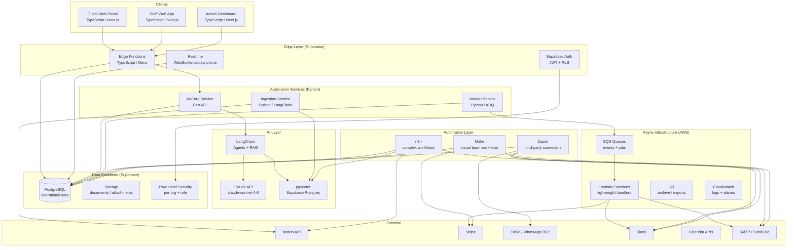
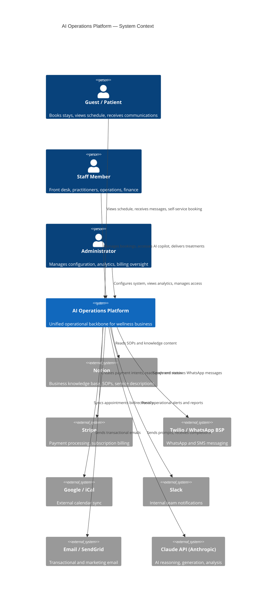
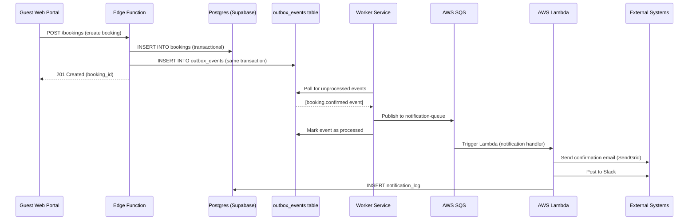

# Architecture Document
## AI Operations Platform — Wellness / Clinic / Hotel

**Version:** 1.0  
**Date:** 2026-04-23  

---

## 1. Bounded Contexts

The platform is decomposed into eleven bounded contexts. Each owns its data and exposes a defined interface to other contexts. Supabase is the shared persistence layer, but each context has its own schema namespace.

| Context | Owns | Depends On |
|---|---|---|
| **Identity & Tenancy** | Organisations, users, roles, sessions | — |
| **CRM / Leads** | Leads, lead sources, qualification status | Identity |
| **Guest Profile** | Guests, health data, preferences, timeline | Identity, CRM |
| **Bookings & Stays** | Stays, room assignments, check-in/out lifecycle | Guest Profile |
| **Scheduling** | Appointments, practitioner schedules, resource allocation | Bookings, Guest Profile |
| **Clinical Records** | Treatment notes, health assessments, contraindications | Guest Profile, Scheduling |
| **Billing** | Packages, inclusions, billable events, invoices | Bookings, Scheduling |
| **Communications** | Notifications, message threads, templates | All contexts (event-driven) |
| **AI Copilot** | Conversation history, AI action log, suggestions | All contexts (read), Knowledge |
| **Knowledge Base** | Vector embeddings, chunk metadata, ingestion jobs | Notion (external) |
| **Analytics** | Aggregated KPIs, utilisation metrics, reports | All contexts (read-only) |

---

## 2. High-Level Architecture

---

## 3. Context Diagram (C4 Level 1)

---

## 4. Event Flow Diagram

---

## 5. Integration Map

| Integration | Direction | Protocol | Tool / Layer | Justification |
|---|---|---|---|---|
| Notion → pgvector | Inbound | Notion Webhook + REST API | n8n + Python ingestion | Webhook triggers n8n; Python handles chunking + embedding |
| Stripe → Platform | Inbound | Stripe Webhook | AWS Lambda | Idempotent payment event processing |
| Platform → Stripe | Outbound | REST API | Python worker | Invoice-triggered payment intent creation |
| Twilio WhatsApp → Platform | Inbound | Webhook | Supabase Edge Function | Low-latency inbound message routing |
| Platform → Twilio | Outbound | REST API | AWS Lambda | Decoupled from request path |
| Google Calendar ↔ Platform | Bidirectional | CalDAV / Google API | n8n | Complex sync logic needs retry + conflict resolution |
| Platform → Slack | Outbound | Webhook | AWS Lambda | Fire-and-forget alerts |
| Web forms → Platform | Inbound | Webhook / Zapier | Zapier | Fast, no-code form-to-lead ingestion |
| Platform → SendGrid | Outbound | REST API | AWS Lambda | Transactional email via queue |
| Claude API | Outbound | REST API | Python AI-core (direct + LangChain) | See Section 6 |

---

## 6. Claude API vs LangChain vs Deterministic — Decision Matrix

| Scenario | Use | Reason |
|---|---|---|
| Summarise guest history from structured data | **Claude directly** | Single-turn, well-structured input, no tool calls needed |
| Answer "What is our cancellation policy?" | **LangChain RAG** | Requires retrieval from vector store before generation |
| Suggest next best action for a guest | **LangChain Agent** | May need to check booking status, package inclusions, history — multi-step tool calling |
| Draft a personalised welcome message | **Claude directly** | Template + guest data → single completion; no retrieval needed |
| Check if a treatment slot conflicts with another | **Deterministic (SQL)** | Pure constraint check; no language understanding needed |
| Classify a lead inquiry by intent | **Claude directly** | Classification task; structured output; no retrieval |
| Calculate billable extras from included package | **Deterministic (Python)** | Rules engine; billing must be auditable and reproducible |
| Generate a management report narrative | **Claude directly** | Structured data → prose; single-turn |
| Answer complex "what should we charge?" question | **LangChain Agent** | Needs: package rules + service history + billing policy — multi-source |
| Detect anomalies in utilisation data | **Deterministic (Python)** | Statistical thresholds; ML optional later but not in MVP |

**Rule of thumb:**
- If the answer can be computed from rules and data → deterministic
- If the answer requires language understanding on fixed input → Claude directly  
- If the answer requires fetching context from multiple sources → LangChain (RAG or Agent)
- Never use an agent when a deterministic function suffices; agents introduce latency, cost, and failure modes

---

## 7. Layer Responsibilities

### TypeScript Layer
- **apps/web**: Guest-facing portal (booking, messaging, schedule view)
- **apps/admin**: Staff and admin dashboard (operations, analytics, AI copilot)
- **packages/shared-types**: Zod-validated schemas shared across TypeScript consumers
- **Supabase Edge Functions**: Auth hooks, webhook ingestion endpoints, lightweight business logic that needs to run close to the database
- **Integration SDK** (in `packages/`): Typed clients for external APIs (Stripe, Twilio) used by Edge Functions

### Python Layer
- **services/ai-core**: FastAPI service exposing AI endpoints; hosts LangChain chains and agents; integrates with Claude API
- **services/worker**: ARQ-based background worker; processes the outbox table; handles async jobs
- **services/ingestion**: Notion → vector pipeline; document processing; chunking; embedding

### Supabase Data Backbone
- Postgres: All operational data with RLS enforced
- Auth: JWT issuance, role claims, organisation scoping
- Storage: Document attachments (medical records, consent forms, invoices — with signed URLs)
- Realtime: Push schedule updates and notification counts to connected clients
- pgvector: Semantic search over knowledge chunks

### Automation Layer (see Phase 5 for full classification)
- **n8n**: Complex workflows needing retry logic, branching, and observability (Notion sync, escalations, daily reports)
- **Zapier**: Fast third-party integrations where the business team can self-serve (form → lead, calendar triggers)
- **Make**: Visual workflows that business teams edit (booking confirmation sequences, follow-up emails)

### AWS Async Infrastructure
- **SQS**: Durable queuing for notification delivery, webhook retries, async job dispatch
- **Lambda**: Stateless handlers for external API calls (email, Slack, payment webhooks)
- **S3**: Long-term document archive; exported reports; Lambda deployment packages
- **CloudWatch**: Centralised logs, metric alarms, dead-letter queue monitoring

### Notion Knowledge Layer
- Editable by non-technical staff
- Single source of truth for: SOPs, service descriptions, treatment protocols, pricing policies, guest FAQs
- Changes propagate to vector store via webhook → n8n → ingestion pipeline
- NOT used for operational data (no live guest records in Notion)

---

## 8. Scalability and Evolution Notes

- **Current scale target**: 100 concurrent staff users, 500 active guests, 10K knowledge chunks
- **Bottleneck watch**: pgvector similarity search degrades past ~1M vectors; monitor query time; migrate to Qdrant when needed
- **Stateless services**: Both ai-core and worker are stateless; horizontal scaling via container replication
- **Multi-tenancy**: `organisation_id` on every table + RLS policy; adding a new tenant is a data operation, not a code change
- **Event schema evolution**: All events are versioned (`"version": "1"` field); consumers tolerate unknown fields
- **LangChain isolation**: All LangChain code is behind service boundaries; swapping LangChain for a direct implementation does not affect callers
